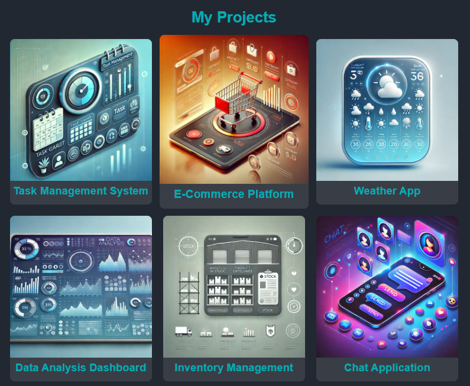

# Jardel Alves - Fullstack Developer Portfolio

Welcome to my personal portfolio! This site showcases my skills, projects, and experience as a Fullstack Developer, with expertise in **Python**, **JavaScript**, **React**, **Node.js**, and **cloud services** like **AWS** and **Azure**.

## 🌟 Overview

This portfolio is built using HTML, CSS, and JavaScript, and integrates with the **GitHub API** to display my latest projects and with the **OpenWeatherMap API** to show the current weather in Florianopolis.

## 🚀 Features

- **Dynamic GitHub Projects**: Automatically displays my latest repositories using the GitHub API.
- **Weather Widget**: Shows the current weather in Florianopolis using the OpenWeatherMap API.
- **Responsive Design**: Optimized for desktop and mobile devices.
- **Contact Form**: Allows visitors to reach out to me directly through the website.
- **Modern UI/UX**: Styled with CSS to create a sleek and engaging user experience.

## 📸 Preview

## 💡 Technologies Used

- **HTML5** and **CSS3** for structure and styling.
- **JavaScript** for dynamic content and API integrations.
- **GitHub API** for listing my latest projects.
- **OpenWeatherMap API** for weather data.
- **Responsive Design** for a seamless experience on all devices.

